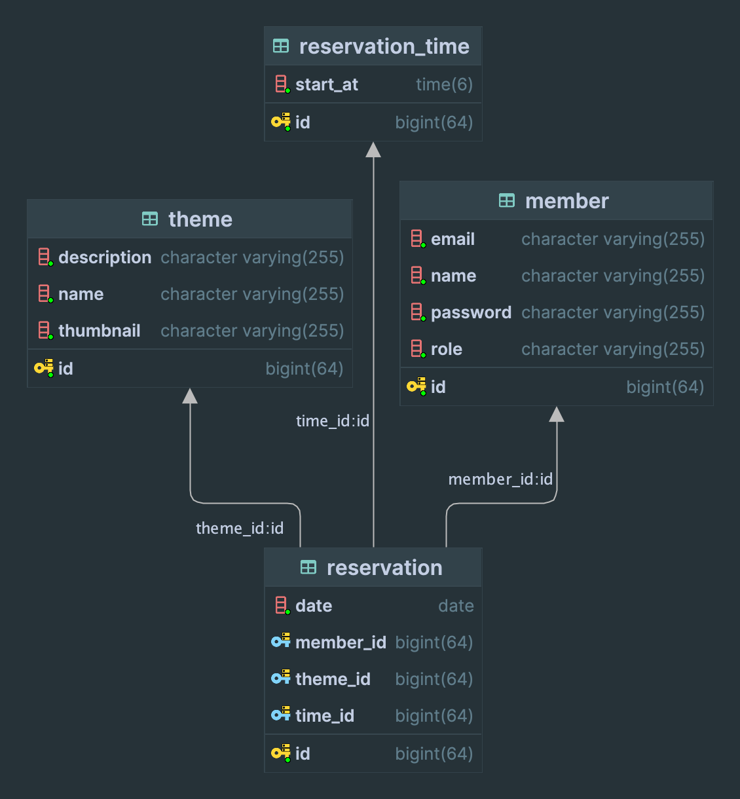

## ERD

## 1 단계
- [x] JPA를 활용하여 데이터베이스에 접근하도록 수정한다.

- [x] `gradle spring-boot-starter-data-jpa`  의존성 추가
- [x] 엔티티 매핑
    - [x] 다른 클래스를 의존하지 않는 클래스 먼저 엔티티 설정을 한다.

- [x] 연관관계 매핑
    - [x] 다른 클래스에 의존하는 클래스는 연관관계 매핑을 추가로 한다.

## 2단계

- [x] 내 예약 목록을 조회하는 API를 구현한다.

## API 명세서

- 내 예약 목록 조회

### Request

> GET member/reservations HTTP/1.1 <br>
> cookie:token=eyJhbGciOiJIUzI1NiJ9.eyJzdWIiOiIxIiwibmFtZSI6IuyWtOuTnOuvvCIsInJvbGUiOiJBR
> E1JTiJ9.vcK93ONRQYPFCxT5KleSM6b7cl1FE-neSLKaFyslsZM <br>
> host: localhost:8080

### Response

> HTTP/1.1 200 <br>
> Content-Type: application/json

```json
[
  {
    "reservationId": 1,
    "theme": "테마1",
    "date": "2024-03-01",
    "time": "10:00",
    "status": "예약"
  },
  {
    "reservationId": 2,
    "theme": "테마2",
    "date": "2024-03-01",
    "time": "12:00",
    "status": "예약"
  },
  {
    "reservationId": 3,
    "theme": "테마3",
    "date": "2024-03-01",
    "time": "14:00",
    "status": "예약"
  }
]
```

## 방탈출 카페 정책

- [x] 방탈출 카페가 시작되는 시간은 8시 이고, 끝나는 시간은 10시이다.

### 예약 대기 및 예약 정책

- [ ] 예약을 취소하는 경우 그 다음 예약 대기자가 자동으로 예약 처리가 된다.
- [ ] 방탈출 하루 전에는 예약을 취소할 수 없다.
