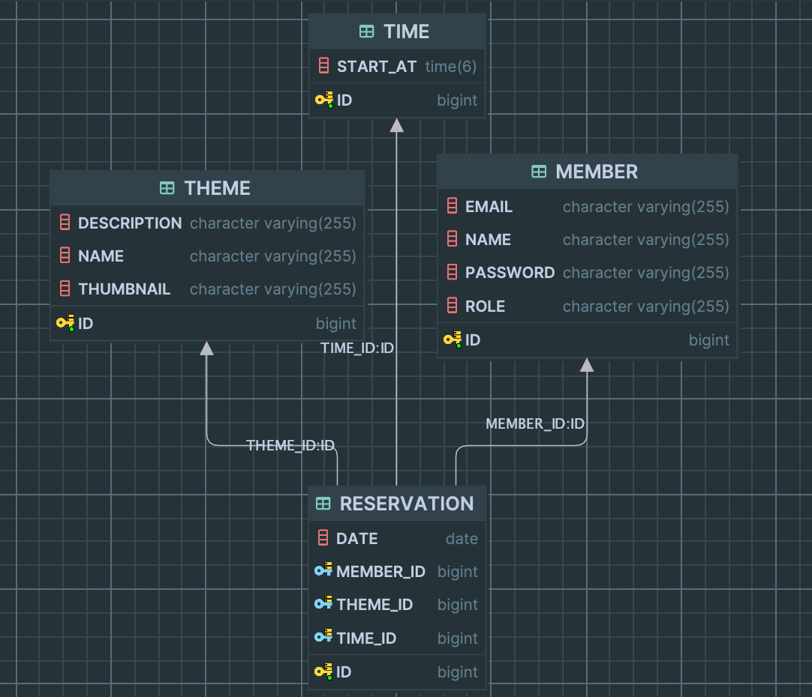

#  방탈출 예약 대기

## 예약 정책
- 예약 요청을 했을 때 예약이 있으면 예약 대기가 된다.
- 예약 대기 요청을 했을 때 예약이 없으면 예약이 된다.
  - 즉, 예약 요청 api와 예약 대기 요청 api는 동일하다.
- 유저가 `예약 대기 취소`는 할 수 있지만 `예약 취소`는 어드민만 할 수 있다. 
- 내 예약 내역 조회는 오늘 날짜 포함 이후만 보여준다.
- 어드민이 예약 취소를 했을 때 예약 대기가 있으면 우선순위에 따라 자동으로 예약 된다.
  - 어드민이 예약 승인을 따로 할 필요가 없다.

### ERD

## 4단계 기능 구현 목록
- [x] 예약 대기 페이지 렌더링
- [x] 예약 대기 목록 조회
- [x] 예약 대기 취소
- [x] 예약 취소시 예약 대기 1번 자동 예약

## 3단계 기능 구현 목록
- [x] 예약 대기 요청 기능
  - [x] 예약이 존재할 경우 예약 대기로 요청된다.
  - [x] 예약이 없으면 예약 대기는 예약이 된다.
- [x] 예약 대기 취소 기능
- [x] 내 예약 목록 조회 시 예약 대기 목록도 함께 포함
- [x] 중복 예약 불가능
- [x] 내 예약 목록의 예약 대기 상태에 몇 번째 대기인지 표시

## 1-2단계 기능 구현 목록

- [x] 내 예약 목록을 조회하는 API
  - [x] 예약의 상태를 조회할 수 있다 ex) `예약`
  - [x] 현재 날짜를 포함하여 이후의 예약을 조회한다. 
  - [x] 내 예약은 최신순으로 조회한다.

## API
- 내 예약 목록 조회 : GET `/reservations-mine`
- 예약 대기 요청 : 예약 요청과 동일
