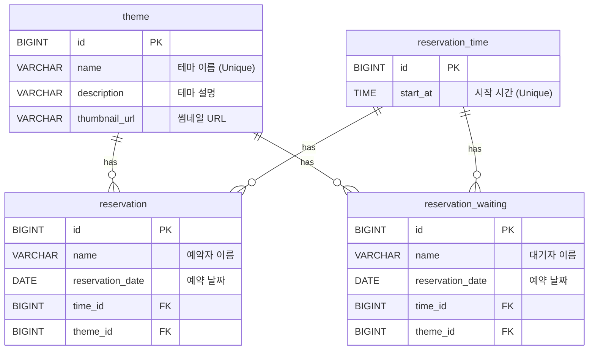

# 방탈출 예약 시스템 (Spring Roomescape Waiting)

## 1. 도메인 별 기능 정의 (기능과 불가능한 것)

이 프로젝트는 크게 **예약(Reservation)**, **예약 대기(Reservation Waiting)**, **테마(Theme)**, **예약 시간(Reservation Time)** 4가지 도메인으로
구성되어 있습니다. 각 도메인별 수행 가능한 기능과 불가능한(예외 처리된) 제약 조건은 다음과 같습니다.

### 1) 예약 (Reservation)

- **기능 (Possible)**
    - 특정 날짜와 예약 시간에 선택한 테마로 신규 예약을 생성할 수 있습니다.
    - 내 이름(예약자명)과 비밀번호(또는 별도 인증 수단)로 등록된 전체 예약 내역 조회가 가능합니다.
    - 확정된 예약은 날짜 및 비어있는 다른 시간대로 자유롭게 변경(Update)이 가능합니다.
    - 불필요해진 내 예약은 직접 취소(삭제)가 가능합니다.
        - **자동 승급 로직**: 예약을 취소했을 때 해당 슬롯(동일 날짜/시간/테마)에 대기 중인 사용자가 있다면, 가장 먼저 대기를 신청한 사용자(1순위)가 자동으로 예약 확정 상태로 전환됩니다.
    - (관리자 기능) 시스템 내 모든 예약 목록을 조회하고 임의로 내역을 삭제할 수 있습니다. (관리자 삭제 시에도 자동 승급 로직이 작동합니다)

- **불가능한 것 (Impossible - ⚠️ 에러 처리)**
    - 과거의 날짜 혹은 이미 지나간 시간으로는 예약할 수 없습니다. (`422 Unprocessable Entity`)
    - 이미 누군가 예약하여 선점한 슬롯(동일 날짜, 시간, 테마)에는 중복으로 예약할 수 없습니다. (대신 '대기'만 가능)
    - 예약 시 이름, 비밀번호, 날짜, 시간, 테마 등 필수 요청 정보가 누락되면 생성할 수 없습니다. (`400 Bad Request`)
    - 예약 생성 시 설정한 정보(비밀번호 등)가 일치하지 않으면 타인의 예약 내역을 변경하거나 삭제할 수 없습니다. (`403 Forbidden`)

### 2) 예약 대기 (Reservation Waiting)

- **기능 (Possible)**
    - 확정 예약이 가득 차서 자리가 없는 슬롯에 예약 대기(Waiting)를 신청할 수 있습니다.
    - 내 예약 조회 시 '대기' 상태인 내역이 함께 조회되며, 생성일시(선입선출) 기준으로 산정된 '현재 대기 순번(N번째)'을 확인할 수 있습니다.
    - 원치 않는 예약 대기는 목록에서 곧바로 취소(삭제)할 수 있습니다.

- **불가능한 것 (Impossible - ⚠️ 에러 처리)**
    - 자리가 비어있는(예약 가능한) 슬롯에는 예약 대기를 신청할 수 없습니다. (즉시 예약을 해야 함)
    - 동일한 슬롯에 한 명의 사용자가 여러 번 중복으로 대기를 신청할 수 없습니다.
    - 대기 상태의 내역은 예약과 달리 날짜나 시간을 임의로 '변경'할 수 없습니다. (취소 후 재신청만 가능)
    - 지나간 날짜나 이미 끝난 시간 슬롯에는 대기를 신청할 수 없습니다.

### 3) 테마 (Theme)

- **기능 (Possible)**
    - 플랫폼에 등록된 모든 테마 목록 조회가 가능합니다.
    - **예약 신청일(생성일) 기준** 최근 7일 동안 가장 많이 예약된 인기 테마(Top 10)를 정렬하여 조회할 수 있습니다.
    - (관리자 기능) 새로운 테마를 등록하거나 기존 테마를 시스템에서 삭제할 수 있습니다.

- **불가능한 것 (Impossible - ⚠️ 에러 처리)**
    - 이름, 설명, 썸네일 중 하나라도 누락된 채로 테마를 생성할 수 없습니다.
    - 기존에 등록된 테마와 동일한 이름으로 중복 등록할 수 없습니다. (`400 Bad Request`)
    - 이미 예약이나 예약 대기 내역이 존재하는(사용 중인) 테마는 강제로 삭제할 수 없습니다. (DB 무결성 제약)

### 4) 예약 시간 (Reservation Time)

- **기능 (Possible)**
    - 운영 중인 전체 예약 시간 목록 조회가 가능합니다.
    - 특정 날짜와 테마를 기준으로 **예약 현황 테이블을 조회하여**, 예약 가능한 시간과 이미 꽉 차서 대기만 가능한 시간을 구분하여(상태값으로) 제공받을 수 있습니다.
    - (관리자 기능) 새로운 예약 시간을 등록하거나 기존 시간을 삭제할 수 있습니다.

- **불가능한 것 (Impossible - ⚠️ 에러 처리)**
    - 기존에 등록된 시간과 완벽히 동일한 시간을 중복 등록할 수 없습니다.
    - 특정 사용자의 예약이나 대기 내역과 연결되어 있는 예약 시간은 관리자가 임의로 삭제할 수 없습니다.

---

## 2. ERD

```mermaid
erDiagram
    theme {
        BIGINT id PK
        VARCHAR name "테마 이름 (Unique)"
        VARCHAR description "테마 설명"
        VARCHAR thumbnail_url "썸네일 URL"
    }
    
    reservation_time {
        BIGINT id PK
        TIME start_at "시작 시간 (Unique)"
    }
    
    reservation {
        BIGINT id PK
        VARCHAR name "예약자 이름"
        DATE reservation_date "예약 날짜"
        BIGINT time_id FK
        BIGINT theme_id FK
    }
    
    reservation_waiting {
        BIGINT id PK
        VARCHAR name "대기자 이름"
        DATE reservation_date "예약 날짜"
        BIGINT time_id FK
        BIGINT theme_id FK
    }

    theme ||--o{ reservation : "has"
    reservation_time ||--o{ reservation : "has"
    
    theme ||--o{ reservation_waiting : "has"
    reservation_time ||--o{ reservation_waiting : "has"
```

---

## 3. API 명세서

전체 API에 대한 상세 명세(Endpoint, Request/Response 형식, 상태 코드, 인증 방식 등)는 아래 파일에서 확인할 수 있습니다.

**[API 명세서 보기 (docs/API.md)](./docs/API.md)**
