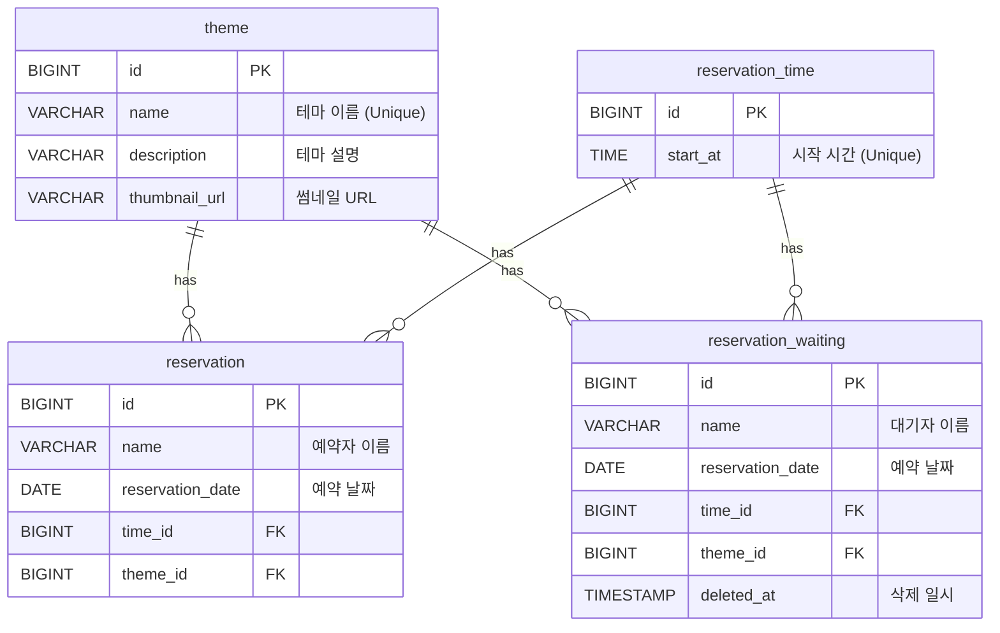

# 방탈출 예약 시스템 (Spring Roomescape Waiting)

## 1. 기능 요구 사항 정의 & 기능 목록

본 시스템은 예약(Reservation), 예약 대기(Reservation Waiting), 테마(Theme), 예약 시간(Reservation Time) 도메인으로 구성되어 있으며, 각 도메인별 기능 목록은 다음과
같음.

### 1.1 예약 시간 (Reservation Time)

- [x] **전체 시간 목록 조회**: 등록된 모든 예약 시간 슬롯을 조회할 수 있음.
- [x] **예약 가능 시간 조회**: 특정 날짜와 테마에 대해 예약 가능한 시간 슬롯과 이미 선점된 슬롯(대기 신청 대상)을 구분하여 상태값(`alreadyBooked`)과 함께 반환함.
- [x] **[관리자] 예약 시간 등록**: 새로운 시간 슬롯을 추가함. (중복 시간 등록 불가)
- [x] **[관리자] 예약 시간 삭제**: 불필요한 예약 시간을 삭제함. (해당 시간을 참조 중인 예약/대기가 있는 경우 삭제 불가)

### 1.2 테마 (Theme)

- [x] **전체 테마 목록 조회**: 등록된 모든 방탈출 테마 목록을 조회함.
- [x] **인기 테마 조회**: 최근 N일간 예약(생성일 기준)이 가장 많이 누적된 테마 순서대로 정렬하여 상위 M개의 테마 목록을 반환함.
- [x] **[관리자] 테마 등록**: 신규 테마를 등록함. (중복 이름 등록 불가)
- [x] **[관리자] 테마 삭제**: 기존 테마를 삭제함. (예약/대기 내역이 존재하는 테마는 삭제 불가)

### 1.3 예약 (Reservation)

- [x] **예약 생성**: 예약 가능 상태의 슬롯에 사용자가 이름, 날짜, 시간, 테마를 지정하여 예약을 신청 및 확정함.
- [x] **내 예약 목록 조회**: 사용자명을 파라미터로 입력하여 자신의 예약 내역을 조회함. (대기 내역도 상태값과 함께 함께 반환함)
- [x] **내 예약 수정**: 본인 인증(Authorization 헤더) 후 날짜 및 다른 시간대로 예약을 수정할 수 있음. (과거 날짜/시간 또는 중복 슬롯으로 수정 불가)
- [x] **내 예약 취소**: 본인 인증 후 예약을 취소할 수 있음.
    - **자동 예약 승급 로직**: 예약이 취소되면 해당 시간 슬롯에 등록된 대기자 중 가장 먼저 대기를 신청한 사용자(1순위)가 자동으로 예약 확정 상태로 자동 승급 처리됨.
- [x] **[관리자] 전체 예약 조회**: 모든 사용자의 예약 내역을 통합 조회함.
- [x] **[관리자] 예약 강제 삭제**: 소유자 인증 없이 예약을 강제로 삭제할 수 있음. (이때도 자동 승급 로직이 수행됨)

### 1.4 예약 대기 (Reservation Waiting)

- [x] **예약 대기 신청**: 이미 예약이 차서 자리가 없는 슬롯에 대기를 등록함. (자리가 빈 슬롯에는 대기 불가)
- [x] **예약 대기 순번 조회**: 내 예약 조회 시 대기 중인 슬롯의 순번(선입선출 대기 순번)을 확인할 수 있음.
- [x] **예약 대기 취소**: 본인 인증을 거쳐 대기 중인 내역을 언제든 취소 및 삭제할 수 있음. (대기 내역은 임의 수정 불가)

---

## 2. ERD & 데이터 모델 결정 이유

### 2.1 ERD (Entity Relationship Diagram)

```mermaid
erDiagram
    theme {
        BIGINT id PK
        VARCHAR name "테마 이름 (Unique)"
        VARCHAR description "테마 설명"
        VARCHAR thumbnail_url "썸네일 URL"
    }
    
    reservation_time {
        BIGINT id PK
        TIME start_at "시작 시간 (Unique)"
    }
    
    reservation {
        BIGINT id PK
        VARCHAR name "예약자 이름"
        DATE reservation_date "예약 날짜"
        BIGINT time_id FK
        BIGINT theme_id FK
    }
    
    reservation_waiting {
        BIGINT id PK
        VARCHAR name "대기자 이름"
        DATE reservation_date "예약 날짜"
        BIGINT time_id FK
        BIGINT theme_id FK
        TIMESTAMP deleted_at "삭제 일시"
    }

    theme ||--o{ reservation : "has"
    reservation_time ||--o{ reservation : "has"
    theme ||--o{ reservation_waiting : "has"
    reservation_time ||--o{ reservation_waiting : "has"
```

### 2.2 데이터 모델 결정 이유

* **예약(`reservation`)과 대기(`reservation_waiting`)의 분리**:
  예약(확정된 거래)과 대기(대기 열 데이터)는 데이터의 변경 주기, 라이프사이클 및 업무적 성격이 완전히 다르므로 테이블을 물리적으로 분리하여 무결성을 보호하고 비즈니스 흐름을 격리함.
* **대기 순번 정렬 및 비관적 락(`FOR UPDATE`) 적용**:
  예약 취소에 따른 대기자 자동 승급 시, 먼저 신청한 사람이 안전하게 승급되도록 대기자 조회 쿼리에 `FOR UPDATE` 비관적 락을 걸고 ID 순으로 정렬하여 동시성 레이스 컨디션을 데이터베이스 수준에서 원천 차단함.
  * **적용 이유**: 대기 순번 정렬 및 비관적 락을 적용한 이유는 데이터베이스 제약 조건(DB Constraint)만으로는 이를 제한할 수 없기 때문임.

---

## 3. 테스트 전략

* **단위 테스트 (도메인 계층)**: 도메인 엔티티 내부의 제약 조건 및 핵심 비즈니스 규칙을 검증함.
* **슬라이스 테스트 (표현 계층)**: 컨트롤러의 HTTP 요청/응답 바인딩, 입력값 검증 및 인증/인가 동작을 검증함.
* **트랜잭션 테스트 (서비스 계층)**: 예외 발생 시 서비스 메서드의 데이터 정상 롤백 여부와 트랜잭션 속성을 검증함.
* **통합 테스트 (시스템 전체)**: 전체적인 API 흐름(E2E) 및 다중 스레드 상황에서의 동시성 제어 시나리오를 검증함.

---

## 4. API 명세서

전체 API에 대한 상세 명세(Endpoint, Request/Response 형식, 상태 코드, 인증 방식 등)는 아래 파일 링크를 통해 확인할 수 있음.

**[API 명세서 보기 (docs/API.md)](./docs/API.md)**
