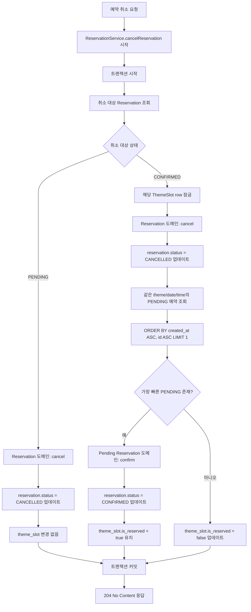
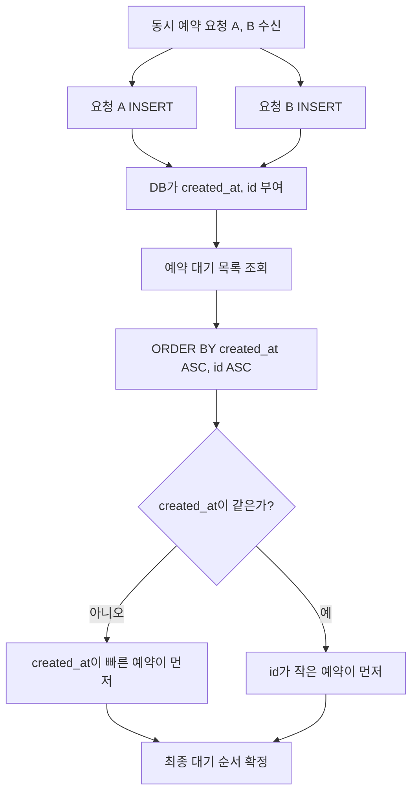

# 방탈출 예약 대기

## 기능 요구 사항

방탈출 사용자 예약 미션까지는 한 슬롯(날짜+시간+테마)에 한 명만 예약할 수 있었고, 이미 예약된 슬롯은 사용자에게 보이지 않았다.
이번 사이클부터는 이미 예약된 슬롯에 대기를 신청할 수 있고, 사용자는 본인의 예약과 대기를 함께 조회할 수 있다.

이번 사이클의 작업도 백엔드 API 추가와 사용자가 보는 화면을 만드는 것 두 가지를 함께 진행한다.
API에 맞춰 페어가 함께 사용자가 사용하는 클라이언트 화면을 만들고, 각 단계의 화면이 브라우저에서 정상 동작하는 것까지 확인한다. 화면 작성에는 AI를 활용해도 좋다.

### 1단계 - 예약 대기 신청/취소

이미 다른 사용자에 의해 예약된 슬롯(날짜+시간+테마)에 대기를 신청할 수 있다.

같은 슬롯에 대한 대기는 신청 순서대로 순번이 부여된다.

같은 사용자가 같은 슬롯에 중복 대기할 수 없다.

사용자는 본인의 대기를 취소할 수 있다.

#### 예약 대기 신청

```
POST /reservations
```

**요청 Body**

```json
{
  "name": "브라운",
  "date": "2026-05-15",
  "timeId": 1,
  "themeId": 1
}
```


| 필드    | 타입      | 필수 | 설명                    |
| ------- | --------- | ---- | ----------------------- |
| name    | String    | O    | 예약자 이름 (공백 불가) |
| date    | LocalDate | O    | 예약 날짜 (과거 불가)   |
| timeId  | Long      | O    | 예약 시간 ID            |
| themeId | Long      | O    | 테마 ID                 |

**응답 201 Created** — 등록된 예약 단건 (전체 예약 조회 요소와 동일한 형식)


| 에러 상황             | 상태 코드                |
| --------------------- | ------------------------ |
| 유효하지 않은 입력값  | 400 Bad Request          |
| 과거 날짜 예약 시도   | 422 Unprocessable Entity |
| 시간 ID 없음          | 404 Not Found            |
| 테마 ID 없음          | 404 Not Found            |
| 중복 사용자 슬롯 예약 | 404 Not Found            |

### 예약 취소

```
PATCH /reservations/{reservationId}/cancel
```


| 경로 변수     | 타입 | 설명    |
| ------------- | ---- | ------- |
| reservationId | Long | 예약 ID |

**응답 204 No Content**


| 에러 상황                                                  | 상태 코드                |
| ---------------------------------------------------------- | ------------------------ |
| 예약 없음                                                  | 404 Not Found            |
| 본인 예약이 아닌 경우                                      | 403 Forbidden            |
| 취소할 수 없는 예약 (이미 취소되었거나, 완료 처리 된 예약) | 422 Unprocessable Entity |

---

### 예약 플로우

취소하고자 하는 예약이 PENDING이라면

- [X]  cancel로 상태 변경

최소하고자 하는 예약이 CONFIRMNED이라면

- [X]  cancel로 상태 변경

- 이때 만약 대기하고 있는 PENDING 예약이 존재한다면
  - [X]  대기중인 PENDING 예약을 CONFIRM으로 변경하고 업데이트
- 대기하고 있는 PENDING 예약이 없다면
  - [X]  themeSlot을 false로 변경후 업데이트 한다.

취소하고자 하는 예약이 COMPLETE, CANCELLED라면

- [ ]  취소할 수 없다는 예외처리

### 상태 변환 흐름


### 2단계 - 내 예약 목록 조회 (상태 구분)

이전 미션의 내 예약 목록 조회를 확장한다.
사용자의 예약과 대기가 상태로 구분되어 함께 표시된다.
대기에는 본인의 대기 순번도 함께 보여준다.


#### 내 예약 조회

```
GET /reservations?name={name}
```

| 파라미터 | 타입   | 필수 | 설명      |
|----------|--------|------|-----------|
| name     | String | O    | 예약자 이름 |

**응답 200 OK**
```json
{
  "reservationResponses": [
    {
      "id": 1,
      "name": "브라운",
      "date": "2026-05-15",
      "time": {
        "id": 1,
        "startAt": "10:00",
        "isAvailable": true
      },
      "theme": {
        "id": 1,
        "name": "공포의 방",
        "description": "무서운 방탈출",
        "thumbnailUrl": "https://example.com/thumbnail.jpg"
      },
      "status": "CONFIRMED"
    }
  ],
  "waitingReservationResponses": [
    {
      "id": 1,
      "name": "브라운",
      "date": "2026-05-15",
      "time": {
        "id": 1,
        "startAt": "10:00",
        "isAvailable": true
      },
      "theme": {
        "id": 1,
        "name": "공포의 방",
        "description": "무서운 방탈출",
        "thumbnailUrl": "https://example.com/thumbnail.jpg"
      },
      "status": "CONFIRMED",
      "waitingOrder": 1
    }
  ]
}
```


### 중요 로직 플로우


```mermaid
flowchart TD
    A[예약 취소 요청] --> B[ReservationService.cancelReservation 시작]
    B --> TX[트랜잭션 시작]

    TX --> C[취소 대상 Reservation 조회]
    C --> D{취소 대상 상태}

    D -- PENDING --> E[Reservation 도메인: cancel]
    E --> F[reservation.status = CANCELLED 업데이트]
    F --> G[theme_slot 변경 없음]
    G --> COMMIT[트랜잭션 커밋]

    D -- CONFIRMED --> H[해당 ThemeSlot row 잠금]
    H --> I[Reservation 도메인: cancel]
    I --> J[reservation.status = CANCELLED 업데이트]

    J --> K[같은 theme/date/time의 PENDING 예약 조회]
    K --> L[ORDER BY created_at ASC, id ASC LIMIT 1]

    L --> M{가장 빠른 PENDING 존재?}

    M -- 예 --> N[Pending Reservation 도메인: confirm]
    N --> O[reservation.status = CONFIRMED 업데이트]
    O --> P[theme_slot.is_reserved = true 유지]
    P --> COMMIT

    M -- 아니오 --> Q[theme_slot.is_reserved = false 업데이트]
    Q --> COMMIT

    COMMIT --> R[204 No Content 응답]
```


```mermaid
flowchart TD
    A[동시 예약 요청 A, B 수신] --> B[요청 A INSERT]
    A --> C[요청 B INSERT]

    B --> D[DB가 created_at, id 부여]
    C --> D

    D --> E[예약 대기 목록 조회]

    E --> F[ORDER BY created_at ASC, id ASC]

    F --> G{created_at이 같은가?}

    G -- 아니오 --> H[created_at이 빠른 예약이 먼저]
    G -- 예 --> I[id가 작은 예약이 먼저]

    H --> J[최종 대기 순서 확정]
    I --> J
```
