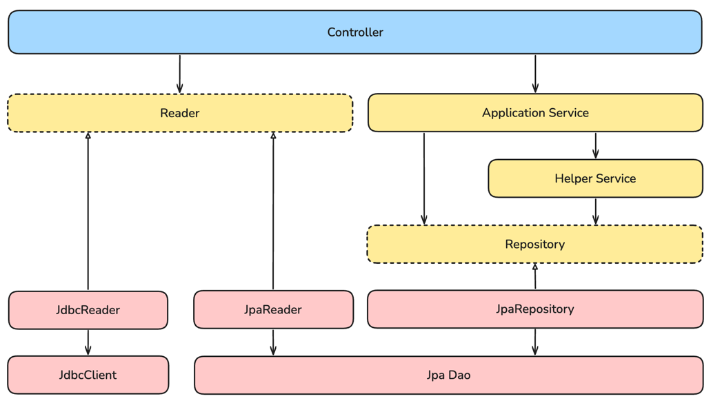

## 패키지 구조

```text
├── auth 
│  ├── config : 보안 관련 Interceptor, ArgumentResolver
│  └── jwt : JWT 관련 유틸
├── business
│  ├── dto : 비즈니스 계층 DTO
│  ├── model
│  │  ├── entity : 도메인 엔티티 객체
│  │  ├── repository : 도메인 리포지토리 객체 (일급 컬렉션)
│  │  └── vo : 도메인 밸류 객체
│  └── service
│      ├── application : 애플리케이션 서비스
│      ├── helper : 서비스를 도와주는 Helper 객체
│      └── reader : 읽기 전용 서비스
├── exception
│  ├── auth : 보안 예외 구현체
│  └── business : 비즈니스 예외 구현체
├── infrastructure
│  ├── reader : 읽기 전용 서비스 구현체
│  └── repository : 도메인 리포지토리 구현체
└── presentation
   ├── api : API 컨트롤러
   ├── page : Page 컨트롤러
   └── dto : 프레젠테이션 계층 DTO
```

## 아키텍쳐


