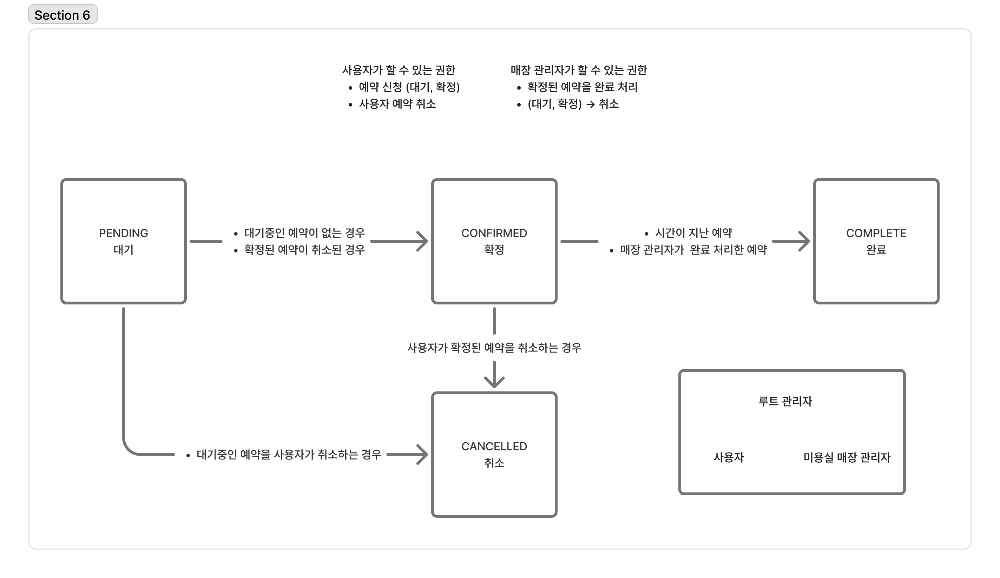
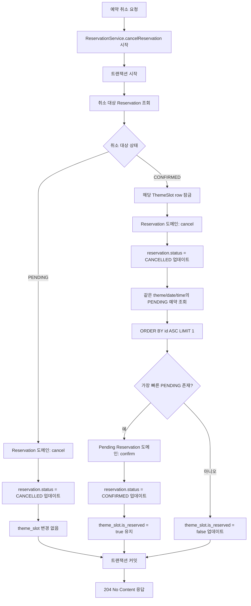
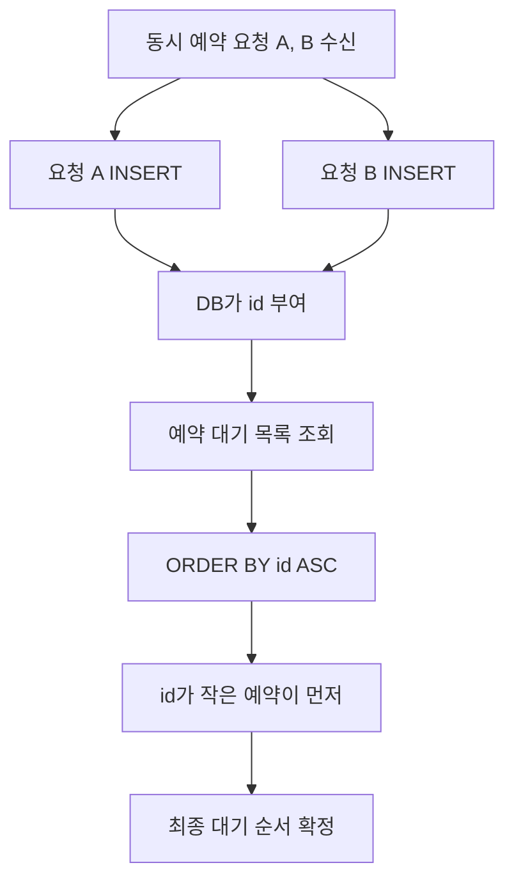

# 방탈출 예약 대기

## 기능 요구 사항

방탈출 사용자 예약 미션까지는 한 슬롯(날짜+시간+테마)에 한 명만 예약할 수 있었고, 이미 예약된 슬롯은 사용자에게 보이지 않았다.
이번 사이클부터는 이미 예약된 슬롯에 대기를 신청할 수 있고, 사용자는 본인의 예약과 대기를 함께 조회할 수 있다.

이번 사이클의 작업도 백엔드 API 추가와 사용자가 보는 화면을 만드는 것 두 가지를 함께 진행한다.
API에 맞춰 페어가 함께 사용자가 사용하는 클라이언트 화면을 만들고, 각 단계의 화면이 브라우저에서 정상 동작하는 것까지 확인한다. 화면 작성에는 AI를 활용해도 좋다.

### 1단계 - 예약 대기 신청/취소

이미 다른 사용자에 의해 예약된 슬롯(날짜+시간+테마)에 대기를 신청할 수 있다.

같은 슬롯에 대한 대기는 신청 순서대로 순번이 부여된다.

같은 사용자가 같은 슬롯에 중복 대기할 수 없다.

사용자는 본인의 대기를 취소할 수 있다.

#### 예약 대기 신청

```
POST /reservations
```

**요청 Body**

```json
{
  "name": "브라운",
  "themeSlotId": 1
}
```

| 필드       | 타입   | 필수 | 설명                         |
|------------|--------|------|------------------------------|
| name       | String | O    | 예약자 이름 (공백 불가)       |
| themeSlotId | Long  | O    | 예약 슬롯 ID (테마+날짜+시간) |

> `themeSlotId`는 `GET /times?themeId={themeId}&date={date}` 응답의 `id` 값이다.

**응답 201 Created** — 등록된 예약 단건 (전체 예약 조회 요소와 동일한 형식)


| 에러 상황                    | 상태 코드                |
|------------------------------|--------------------------|
| 유효하지 않은 입력값         | 400 Bad Request          |
| 슬롯 ID 없음                 | 404 Not Found            |
| 과거 날짜 예약 시도          | 422 Unprocessable Entity |
| 당일 이미 지난 시간으로 예약 | 422 Unprocessable Entity |
| 중복 사용자 슬롯 예약/대기   | 409 Conflict             |

### 예약 취소

```
PATCH /reservations/{reservationId}/cancel
```


| 경로 변수     | 타입 | 설명    |
|---------------|------|---------|
| reservationId | Long | 예약 ID |

| 쿼리 파라미터 | 타입 | 필수 | 설명        |
|---------------|------|------|-------------|
| name          | String | O    | 예약자 이름 |

**응답 204 No Content**


| 에러 상황                                                  | 상태 코드                |
|------------------------------------------------------------|--------------------------|
| 예약 없음                                                  | 404 Not Found            |
| 자신의 예약이 아님                                         | 403 Forbidden            |
| 취소할 수 없는 예약 (이미 취소되었거나, 완료 처리 된 예약) | 422 Unprocessable Entity |

---

### 예약 플로우

취소하고자 하는 예약이 PENDING이라면

- [X]  cancel로 상태 변경

최소하고자 하는 예약이 CONFIRMNED이라면

- [X]  cancel로 상태 변경

- 이때 만약 대기하고 있는 PENDING 예약이 존재한다면
  - [X]  대기중인 PENDING 예약을 CONFIRM으로 변경하고 업데이트
- 대기하고 있는 PENDING 예약이 없다면
  - [X]  themeSlot을 false로 변경후 업데이트 한다.

취소하고자 하는 예약이 COMPLETE, CANCELLED라면

- [ ]  취소할 수 없다는 예외처리

### 상태 변환 흐름



### 2단계 - 내 예약 목록 조회 (상태 구분)

이전 미션의 내 예약 목록 조회를 확장한다.
사용자의 예약과 대기가 상태로 구분되어 함께 표시된다.
대기에는 본인의 대기 순번도 함께 보여준다.


#### 내 예약 조회

```
GET /reservations?name={name}
```

| 파라미터 | 타입   | 필수 | 설명        |
|----------|--------|------|-------------|
| name     | String | O    | 예약자 이름 |

**응답 200 OK**
```json
{
  "reservationResponses": [
    {
      "id": 1,
      "name": "브라운",
      "date": "2026-05-15",
      "time": {
        "id": 1,
        "startAt": "10:00",
        "isAvailable": true
      },
      "theme": {
        "id": 1,
        "name": "공포의 방",
        "description": "무서운 방탈출",
        "thumbnailUrl": "https://example.com/thumbnail.jpg"
      },
      "status": "CONFIRMED"
    }
  ],
  "waitingReservationResponses": [
    {
      "id": 2,
      "name": "브라운",
      "date": "2026-05-15",
      "time": {
        "id": 1,
        "startAt": "10:00",
        "isAvailable": true
      },
      "theme": {
        "id": 1,
        "name": "공포의 방",
        "description": "무서운 방탈출",
        "thumbnailUrl": "https://example.com/thumbnail.jpg"
      },
      "status": "PENDING",
      "waitingOrder": 1
    }
  ]
}
```

> `reservationResponses`에는 PENDING이 아닌 예약(CONFIRMED, COMPLETED, CANCELLED)이 포함된다.
> `waitingReservationResponses`에는 PENDING 상태의 대기 예약이 포함되며, `waitingOrder`는 해당 슬롯에서의 대기 순번이다.


### 중요 로직 플로우


```mermaid
flowchart TD
    A[예약 취소 요청] --> B[ReservationService.cancelReservation 시작]
    B --> TX[트랜잭션 시작]

    TX --> C[취소 대상 Reservation 조회]
    C --> D{취소 대상 상태}

    D -- PENDING --> E[Reservation 도메인: cancel]
    E --> F[reservation.status = CANCELLED 업데이트]
    F --> G[theme_slot 변경 없음]
    G --> COMMIT[트랜잭션 커밋]

    D -- CONFIRMED --> H[해당 ThemeSlot row 잠금]
    H --> I[Reservation 도메인: cancel]
    I --> J[reservation.status = CANCELLED 업데이트]

    J --> K[같은 theme/date/time의 PENDING 예약 조회]
    K --> L[ORDER BY id ASC LIMIT 1]

    L --> M{가장 빠른 PENDING 존재?}

    M -- 예 --> N[Pending Reservation 도메인: confirm]
    N --> O[reservation.status = CONFIRMED 업데이트]
    O --> P[theme_slot.is_reserved = true 유지]
    P --> COMMIT

    M -- 아니오 --> Q[theme_slot.is_reserved = false 업데이트]
    Q --> COMMIT

    COMMIT --> R[204 No Content 응답]
```


```mermaid
flowchart TD
    A[동시 예약 요청 A, B 수신] --> B[요청 A INSERT]
    A --> C[요청 B INSERT]

    B --> D[DB가 id 부여]
    C --> D

    D --> E[예약 대기 목록 조회]

    E --> F[ORDER BY id ASC]

    F --> G[id가 작은 예약이 먼저]

    G --> J[최종 대기 순서 확정]
```

---

## 이번 사이클 기능 목록

- [x] 예약 신청 시 슬롯이 비어 있으면 확정 예약(`CONFIRMED`)으로 등록한다.
- [x] 예약 신청 시 슬롯에 확정 예약이 있으면 대기 예약(`PENDING`)으로 등록한다.
- [x] 같은 사용자가 같은 슬롯에 예약 또는 대기를 중복 신청할 수 없게 한다.
- [x] 사용자는 본인 예약 또는 대기를 취소할 수 있다.
- [x] 확정 예약이 취소되면 같은 슬롯의 첫 번째 대기 예약을 자동으로 확정 예약으로 전환한다.
- [x] 확정 예약 취소 후 대기가 없으면 슬롯을 예약 가능 상태로 해제한다.
- [x] 대기 취소 또는 자동 승격 후 남은 대기 순번을 1번부터 다시 보여준다.
- [x] 내 예약 조회에서 확정/완료/취소 예약과 대기 예약을 분리하고, 대기 예약에는 순번을 포함한다.
- [x] 예약/대기 상태와 순번 변화를 확인할 수 있는 간단한 클라이언트 화면을 제공한다.
- [x] 요구사항 테스트로 자동 승격, 순번 재정렬, 예외 응답을 검증한다.

## 구현 선택과 판단 기록

### 자동 전환 선택

자동 전환을 선택했다. 현재 서비스에는 관리자 권한과 승인 화면이 없고, 확정 예약 취소로 생긴 슬롯 공백은 같은 슬롯의 1번 대기자를 즉시 승격해야 사용자 화면과 데이터 상태가 가장 단순하게 일관된다.

수동 승인은 거절 사유, 관리자 인증, 승인 대기 상태 같은 새 정책이 필요하므로 이번 요구사항 범위에서는 제외했다.

### 트랜잭션 경계

| 기능 | 트랜잭션 경계 | 함께 묶은/분리한 이유 |
|------|---------------|------------------------|
| 예약 신청 | `ReservationService.saveReservation` | 슬롯 잠금, 중복 검사, 슬롯 예약 상태 변경, 예약 저장이 함께 성공해야 같은 슬롯에 확정 예약이 중복 생성되지 않는다. |
| 확정 예약 취소 | `ReservationService.cancelReservation` | 취소 예약 `CANCELLED`, 첫 대기 `CONFIRMED`, 슬롯 예약 여부 변경이 하나의 슬롯 점유 상태를 결정하므로 함께 묶었다. 중간 실패 시 확정자가 사라졌는데 슬롯이 비거나 두 명이 확정되는 상태를 막는다. |
| 대기 예약 취소 | `ReservationService.cancelReservation` | 대기 취소는 해당 예약 상태만 원자적으로 바꾸고, 순번은 조회 시 `PENDING` 목록 기준으로 계산한다. 순번 저장을 분리해 불필요한 다중 업데이트를 피했다. |
| 예약 변경 | `ReservationService.modifyReservation` | 기존 슬롯의 승격/해제와 새 슬롯의 확정/대기 전환이 함께 끝나야 양쪽 슬롯 점유 상태가 어긋나지 않는다. |
| 내 예약 조회 | `ReservationService.findReservationBy` read-only | 예약 목록과 대기 순번 조회는 같은 읽기 유스케이스이므로 읽기 전용 트랜잭션으로 묶어 의도를 드러냈다. |

### 엣지 케이스와 처리 방향

- 이미 취소/완료된 예약 취소: 상태 객체가 `422 Unprocessable Entity` 예외를 발생한다.
- 다른 사용자의 예약 취소: 서비스에서 소유자 이름을 검증해 `403 Forbidden`을 반환한다.
- 취소된 대기자의 재신청: 중복 검사에서 `CANCELLED`를 제외해 다시 대기할 수 있다.
- 앞 순번 대기 취소: 순번을 DB에 저장하지 않고 조회 시 `ROW_NUMBER()`로 계산해 남은 대기가 자동 재정렬된다.
- 확정 예약 취소와 대기 승격: 같은 슬롯 row를 `FOR UPDATE`로 잠가 동시 취소/예약에서 슬롯 점유 상태를 보호한다.

### 테스트 전략

- 서비스 단위 테스트는 fake repository로 상태 전이, 중복 검사, 자동 승격, 순번 재정렬 정책을 빠르게 검증한다.
- 인수 테스트는 실제 Spring/JDBC/API 경로로 HTTP 상태 코드, 응답 구조, 자동 승격 후 사용자 화면에 필요한 조회 결과를 검증한다.
- 트랜잭션 일관성은 확정 예약 취소 후 취소자/승격자/남은 대기자의 최종 상태를 API로 다시 조회해 확인한다.

## API 명세서

### 공통 응답 형식

#### ReservationResponse

```json
{
  "id": 1,
  "name": "브라운",
  "date": "2026-05-15",
  "time": {
    "id": 1,
    "startAt": "10:00:00",
    "isAvailable": true
  },
  "theme": {
    "id": 1,
    "name": "폐병원 탈출",
    "description": "버려진 병원에서 벌어지는 기괴한 일들.",
    "thumbnailUrl": "https://example.com/thumbnail.jpg"
  },
  "status": "CONFIRMED"
}
```

#### WaitingReservationResponse

```json
{
  "id": 1,
  "name": "브라운",
  "date": "2026-05-15",
  "time": {
    "id": 1,
    "startAt": "10:00:00",
    "isAvailable": true
  },
  "theme": {
    "id": 1,
    "name": "폐병원 탈출",
    "description": "버려진 병원에서 벌어지는 기괴한 일들.",
    "thumbnailUrl": "https://example.com/thumbnail.jpg"
  },
  "status": "PENDING",
  "waitingOrder": 1
}
```

#### ThemeResponse

```json
{
  "id": 1,
  "name": "폐병원 탈출",
  "description": "버려진 병원에서 벌어지는 기괴한 일들.",
  "thumbnailUrl": "https://example.com/thumbnail.jpg"
}
```

#### TimeResponse

```json
{
  "id": 1,
  "startAt": "10:00:00",
  "isAvailable": true
}
```

---

### 예약 API

#### 전체 예약 목록 조회

```
GET /reservations
```

**응답 200 OK**

```json
[
  {
    "id": 1,
    "name": "브라운",
    "date": "2026-05-15",
    "time": { "id": 1, "startAt": "10:00:00", "isAvailable": true },
    "theme": { "id": 1, "name": "폐병원 탈출", "description": "...", "thumbnailUrl": "..." },
    "status": "CONFIRMED"
  }
]
```

---

#### 내 예약 목록 조회

```
GET /reservations?name={name}
```

| 쿼리 파라미터 | 타입   | 필수 | 설명        |
|--------------|--------|------|-------------|
| name         | String | O    | 예약자 이름 |

**응답 200 OK**

```json
{
  "reservationResponses": [
    {
      "id": 1,
      "name": "브라운",
      "date": "2026-05-15",
      "time": { "id": 1, "startAt": "10:00:00", "isAvailable": true },
      "theme": { "id": 1, "name": "폐병원 탈출", "description": "...", "thumbnailUrl": "..." },
      "status": "CONFIRMED"
    }
  ],
  "waitingReservationResponses": [
    {
      "id": 2,
      "name": "브라운",
      "date": "2026-05-16",
      "time": { "id": 1, "startAt": "10:00:00", "isAvailable": true },
      "theme": { "id": 1, "name": "폐병원 탈출", "description": "...", "thumbnailUrl": "..." },
      "status": "PENDING",
      "waitingOrder": 1
    }
  ]
}
```

> `reservationResponses`: PENDING이 아닌 예약 목록 (CONFIRMED, COMPLETED, CANCELLED)
> `waitingReservationResponses`: PENDING 상태의 대기 목록 (슬롯 내 대기 순번 포함)

| 에러 상황        | 상태 코드       |
|------------------|----------------|
| name이 빈 문자열 | 400 Bad Request |

---

#### 예약 생성 (대기 신청 포함)

```
POST /reservations
```

**요청 Body**

```json
{
  "name": "브라운",
  "themeSlotId": 1
}
```

| 필드        | 타입   | 필수 | 설명                              |
|-------------|--------|------|-----------------------------------|
| name        | String | O    | 예약자 이름 (공백 불가)            |
| themeSlotId | Long   | O    | 예약 슬롯 ID (`GET /times?themeId&date` 응답의 `id`) |

**응답 201 Created** — ReservationResponse 단건

- 슬롯에 기존 예약이 없으면 `CONFIRMED` 상태로 생성
- 슬롯에 기존 예약이 있으면 `PENDING` 상태(대기)로 생성

| 에러 상황                              | 상태 코드                |
|----------------------------------------|--------------------------|
| 필수 필드 누락 또는 빈 값              | 400 Bad Request          |
| 슬롯 ID 존재하지 않음                  | 404 Not Found            |
| 과거 날짜로 예약 시도                  | 422 Unprocessable Entity |
| 당일 이미 지난 시간으로 예약 시도      | 422 Unprocessable Entity |
| 같은 사용자가 동일 슬롯에 중복 예약/대기 | 409 Conflict           |

---

#### 예약 취소

```
PATCH /reservations/{reservationId}/cancel
```

| 경로 변수     | 타입 | 설명    |
|--------------|------|---------|
| reservationId | Long | 예약 ID |

| 쿼리 파라미터 | 타입 | 필수 | 설명        |
|---------------|------|------|-------------|
| name          | String | O    | 예약자 이름 |

**응답 204 No Content**

- CONFIRMED 예약 취소 시, 같은 슬롯의 첫 번째 PENDING 예약이 자동으로 CONFIRMED로 승격
- PENDING 예약 취소 시, 단순 CANCELLED 처리

| 에러 상황                  | 상태 코드                |
|----------------------------|--------------------------|
| 예약 ID 존재하지 않음      | 404 Not Found            |
| 자신의 예약이 아님         | 403 Forbidden            |
| 이미 취소된 예약           | 422 Unprocessable Entity |
| 이미 완료된 예약           | 422 Unprocessable Entity |

---

#### 예약 수정

```
PATCH /reservations/{reservationId}
```

| 경로 변수     | 타입 | 설명    |
|--------------|------|---------|
| reservationId | Long | 예약 ID |

**요청 Body**

```json
{
  "themeSlotId": 2
}
```

| 필드        | 타입 | 필수 | 설명                    |
|-------------|------|------|-------------------------|
| themeSlotId | Long | O    | 변경할 예약 슬롯 ID      |

**응답 200 OK** — 수정된 ReservationResponse 단건

| 에러 상황                     | 상태 코드                |
|-------------------------------|--------------------------|
| 예약 ID 존재하지 않음         | 404 Not Found            |
| 슬롯 ID 존재하지 않음         | 404 Not Found            |
| 과거 날짜로 변경 시도         | 422 Unprocessable Entity |
| 당일 이미 지난 시간으로 변경  | 422 Unprocessable Entity |
| 같은 사용자가 동일 슬롯에 중복 예약/대기 | 409 Conflict     |

> 변경할 슬롯에 이미 확정 예약이 있으면 예약은 `PENDING` 대기 상태가 된다.

---

#### 예약 삭제

```
DELETE /reservations/{id}
```

| 경로 변수 | 타입 | 설명    |
|----------|------|---------|
| id       | Long | 예약 ID |

**응답 204 No Content**

| 에러 상황             | 상태 코드     |
|-----------------------|---------------|
| 예약 ID 존재하지 않음 | 404 Not Found |

---

### 테마 API

#### 전체 테마 목록 조회

```
GET /themes
```

**응답 200 OK**

```json
[
  {
    "id": 1,
    "name": "폐병원 탈출",
    "description": "버려진 병원에서 벌어지는 기괴한 일들.",
    "thumbnailUrl": "https://example.com/thumbnail.jpg"
  }
]
```

---

#### 인기 테마 조회

```
GET /themes?topCount={topCount}&during={during}
```

| 쿼리 파라미터 | 타입 | 필수 | 설명                            |
|--------------|------|------|---------------------------------|
| topCount     | Long | O    | 조회할 테마 수                   |
| during       | Long | O    | 최근 N일 기준 (오늘 포함 N일 전) |

최근 `during`일 동안 확정 또는 완료된 예약 수가 가장 많은 테마를 `topCount`개 순서대로 반환한다.

**응답 200 OK** — ThemeResponse 배열 (예약 수 내림차순)

```json
[
  {
    "id": 1,
    "name": "폐병원 탈출",
    "description": "버려진 병원에서 벌어지는 기괴한 일들.",
    "thumbnailUrl": "https://example.com/thumbnail.jpg"
  }
]
```

---

#### 테마 생성

```
POST /themes
```

**요청 Body**

```json
{
  "name": "새로운 테마",
  "description": "테마 설명",
  "thumbnailUrl": "https://example.com/thumbnail.jpg"
}
```

| 필드         | 타입   | 필수 | 설명                  |
|--------------|--------|------|-----------------------|
| name         | String | O    | 테마 이름 (공백 불가) |
| description  | String | O    | 테마 설명 (공백 불가) |
| thumbnailUrl | String | O    | 썸네일 URL (공백 불가) |

**응답 201 Created** — ThemeResponse 단건

| 에러 상황                    | 상태 코드       |
|-----------------------------|----------------|
| 필수 필드 누락 또는 빈 값    | 400 Bad Request |

---

#### 테마 삭제

```
DELETE /themes/{id}
```

| 경로 변수 | 타입 | 설명    |
|----------|------|---------|
| id       | Long | 테마 ID |

**응답 204 No Content**

| 에러 상황                       | 상태 코드                |
|---------------------------------|--------------------------|
| 테마 ID 존재하지 않음           | 404 Not Found            |
| 해당 테마를 참조하는 예약 존재  | 422 Unprocessable Entity |

---

### 시간 API

#### 전체 시간 목록 조회

```
GET /times
```

**응답 200 OK**

```json
[
  {
    "id": 1,
    "startAt": "10:00:00",
    "isAvailable": true
  }
]
```

> `isAvailable`은 전체 조회 시 항상 `true`로 반환된다. 특정 날짜·테마 기준 예약 가능 여부는 아래 엔드포인트를 사용한다.

---

#### 테마·날짜 기준 시간 조회 (예약 가능 여부 포함)

```
GET /times?themeId={themeId}&date={date}
```

| 쿼리 파라미터 | 타입      | 필수 | 설명                     |
|--------------|-----------|------|--------------------------|
| themeId      | Long      | O    | 테마 ID                   |
| date         | LocalDate | O    | 조회 날짜 (`yyyy-MM-dd`) |

해당 테마·날짜에 대한 슬롯이 없으면 자동으로 생성 후 반환한다.

**응답 200 OK**

```json
[
  {
    "id": 10,
    "startAt": "10:00:00",
    "isAvailable": true
  },
  {
    "id": 11,
    "startAt": "14:00:00",
    "isAvailable": false
  }
]
```

> `id`는 `theme_slot` 테이블의 ID이다. 예약 생성(`POST /reservations`)의 `themeSlotId`에 이 값을 사용한다.
> `isAvailable`이 `false`이면 해당 슬롯은 이미 예약된 상태이므로 대기 신청만 가능하다.

| 에러 상황              | 상태 코드     |
|-----------------------|---------------|
| 테마 ID 존재하지 않음  | 404 Not Found |

---

#### 시간 생성

```
POST /times
```

**요청 Body**

```json
{
  "startAt": "10:00:00"
}
```

| 필드    | 타입      | 필수 | 설명                               |
|---------|-----------|------|------------------------------------|
| startAt | LocalTime | O    | 시작 시간 (`HH:mm` 또는 `HH:mm:ss`) |

**응답 201 Created** — TimeResponse 단건

| 에러 상황      | 상태 코드       |
|---------------|----------------|
| startAt 누락  | 400 Bad Request |

---

#### 시간 삭제

```
DELETE /times/{id}
```

| 경로 변수 | 타입 | 설명    |
|----------|------|---------|
| id       | Long | 시간 ID |

**응답 204 No Content**

| 에러 상황                       | 상태 코드                |
|---------------------------------|--------------------------|
| 시간 ID 존재하지 않음           | 404 Not Found            |
| 해당 시간을 참조하는 예약 존재  | 422 Unprocessable Entity |
