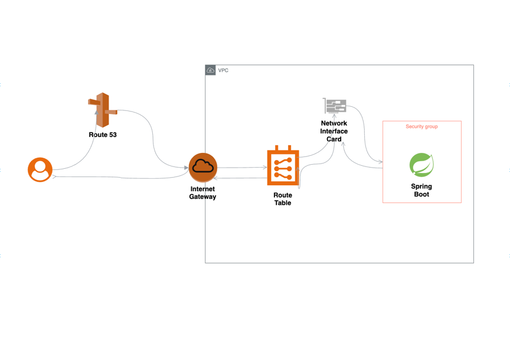

# 방탈출 예약 대기 애플리케이션

## 배포 인프라

## 구현 기능 목록

### 사이클2 1단계 - 예약 대기 승인

- [x] 예약 대기를 승인하여 예약으로 전환
  - 자동 전환(예약 취소 시 대기 1번이 자동으로 예약 전환)
    - 확정 예약 삭제 시
- [x] 대기가 예약으로 전환되면 해당 슬롯의 나머지 대기 순번이 재정렬

### 사이클1 1단계 - 예약 대기 신청/취소

- [x] 이미 다른 사용자에 의해 예약된 슬롯(날짜+시간+테마)에 대기를 신청할 수 있다.
- [x] 같은 슬롯에 대한 대기는 신청 순서대로 순번이 부여된다.
  - Reservation id값을 통해 신청 순서대로 순번을 계산한다.
- [x] 같은 사용자가 같은 슬롯에 중복 대기할 수 없다.
- [x] 사용자는 본인의 대기를 취소할 수 있다.

### 사이클1 2단계 - 내 예약 목록 조회 (상태 구분)

- [x] 이전 미션의 내 예약 목록 조회를 확장한다.
- [x] 사용자의 예약과 대기가 상태로 구분되어 함께 표시된다.
- [x] 대기에는 본인의 대기 순번도 함께 보여준다.

---

## API 명세

### 예약

| Method | URI | 설명 |
|--------|-----|------|
| POST | `/reservations` | 예약 생성 (슬롯 중복 시 자동으로 대기 등록) |
| GET | `/reservations` | 전체 예약 목록 조회 |
| GET | `/reservations/{id}` | 예약 단건 조회 |
| DELETE | `/reservations/{id}` | 예약 취소 |

### 예약 시간

| Method | URI | 설명 |
|--------|-----|------|
| POST | `/times` | 예약 시간 생성 |
| GET | `/times` | 전체 예약 시간 목록 조회 |
| DELETE | `/times/{id}` | 예약 시간 삭제 |

### 테마

| Method | URI | 설명 |
|--------|-----|------|
| POST | `/themes` | 테마 생성 |
| GET | `/themes` | 전체 테마 목록 조회 |
| DELETE | `/themes/{id}` | 테마 삭제 |
| GET | `/themes/most-reserved-themes?limit={n}&startDate={date}&endDate={date}` | 인기 테마 조회 |

---

## 예약 상태

| 상태 | 설명 |
|------|------|
| `RESERVED` | 예약 확정 |
| `WAITING` | 대기 중 |
| `CANCELED` | 취소됨 |