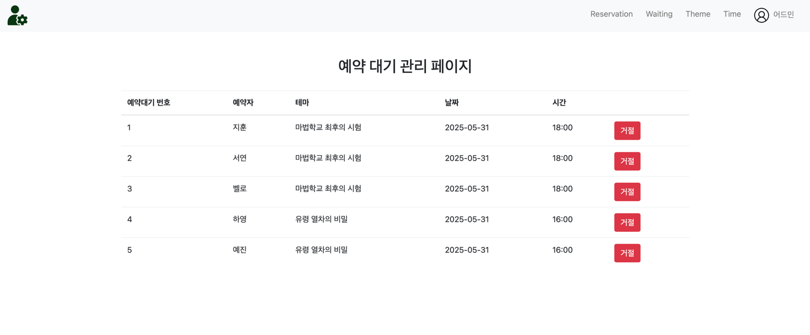

# 방탈출 예약 대기

## 개요

방탈출과 예약 내역을 관리하고, 사용자가 방탈출을 예약할 수 있도록 돕는 웹 애플리케이션입니다.

## 제공 기능

방탈출과 예약을 관리하는 `관리자`와 방탈출을 예약하는 `사용자`의 기능을 제공합니다.

[Quick Start](#quick-start) 섹션으로 이동하여 애플리케이션을 실행하고 기능을 체험할 수 있습니다.

# 추가된 화면 및 기능

## 예약 대기 요청 기능


- 이미 예약된 방탈출에 대해 예약 대기를 요청할 수 있습니다.
- 예약 대기 요청 시 대기 순번이 부여됩니다.
- 예약 대기 요청은 과거 일시로는 요청할 수 없습니다.


- 내 예약 목록에서 예약과 함께 예약 대기를 요청한 내역(순번 포함)을 확인할 수 있습니다.

## 예약 대기 관리 기능 (관리자)



- 관리자는 예약 대기 목록을 확인할 수 있습니다.
- 예약 대기 목록에서 예약 대기를 승인하거나 취소할 수 있습니다.
- 예약 대기를 승인하면 예약 목록에 추가됩니다.
- 예약 대기를 취소하면 예약 대기 목록에서 삭제됩니다.


- 예약 대기를 승인할 때는 기존 예약이 취소된 후 첫 번째 대기인 경우에만 승인할 수 있습니다.

## 요구사항 (변경 사항)

- 예약 대기 요청 기능
    - [x] 예약 대기 요청 화면 추가
    - [x] 예약 대기 요청 API 구현
        - 과거 일시로 예약 대기를 요청 불가
- 내 예약 목록에서 예약 대기 취소 기능 구현
    - [x] 내 예약 목록 화면 수정
    - [x] 대기 순번 기능 구현
    - [x] 예약 대기 취소 API 구현
- [x] 중복 예약이 불가능 하도록 구현
- 예약 대기 관리 기능
    - [x] 예약 대기 목록 화면 추가
    - 예약 대기 목록 API 구현
        - [x] 예약 대기 목록 조회
        - [x] 예약 대기 취소(거절)
    - [x] 예약 대기 승인
        - 예약 취소가 발생 시 예약 대기자가 있는 경우 예약 승인
        - 첫 번째 예약 대기자가 아닌 경우 승인 불가
        - 예약 대기자가 승인된 경우 예약 대기 목록에서 삭제 후 예약 목록에 추가

# Quick Start

애플리케이션 실행 후 아래의 링크로 접속할 수 있습니다.

- 관리자 페이지: [localhost:8080/admin](http://localhost:8080/admin)
- 사용자 페이지: [localhost:8080/](http://localhost:8080/)

## 더미 계정

관리자와 사용자의 더미 계정은 아래와 같습니다. 회원가입 후 로그인도 가능합니다.

```text
관리자 계정: admin@email.com
비밀번호: password
사용자 계정: normal@email.com
비밀번호: password
사용자 계정: jihun@email.com
비밀번호: password
-- 더 많은 계정은 data.sql 파일을 참고하세요.
```
