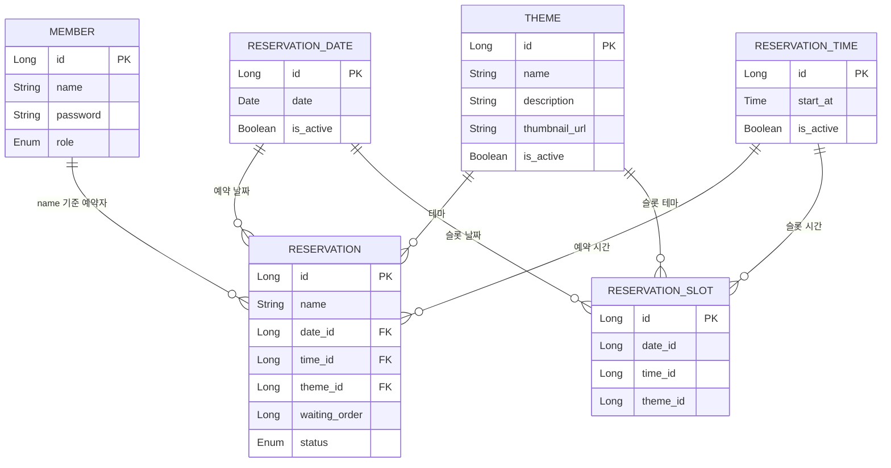

# API 명세서

## 공통 인증

인증이 필요한 API는 다음 요청 헤더를 사용한다.

```http
Authorization: Bearer {token}
```

---

## 1. Member/Auth

### 1-1. 회원가입

- URL: `/member/members`
- Method: `POST`
- Auth: 불필요
- 요청 본문

```json
{
  "name": "송송",
  "password": "password123"
}
```

- 응답 본문 `200 OK`

```json
{
  "id": 1,
  "name": "송송",
  "role": "MEMBER"
}
```

---

### 1-2. 로그인

- URL: `/login`
- Method: `POST`
- Auth: 불필요
- 요청 본문

```json
{
  "name": "송송",
  "password": "password123"
}
```

- 응답 `200 OK`
- 일반 요청 응답 헤더

```http
Authorization: {token}
```

- `room-escape-app` 요청 응답 헤더

```http
Set-Cookie: Authorization={token}; Path=/; HttpOnly; SameSite=None
```

---

## 2. Reservation

### 2-1. 관리자 예약 조회

- URL: `/admin/reservations`
- Method: `GET`
- Auth: `MANAGER`
- 응답 본문 `200 OK`

```json
[
  {
    "id": 1,
    "name": "송송",
    "date": "2026-05-04",
    "time": "12:00:00",
    "themeId": 1,
    "themeName": "공포",
    "themeThumbnailUrl": "https://example.com/theme.png",
    "status": "RESERVED",
    "waitingTurn": null
  }
]
```

---

### 2-2. 관리자 예약 생성

- URL: `/admin/reservations`
- Method: `POST`
- Auth: `MANAGER`
- 요청 본문

```json
{
  "dateId": 1,
  "timeId": 1,
  "themeId": 1
}
```

- 응답 본문 `200 OK`

```json
{
  "id": 1,
  "name": "관리자",
  "date": "2026-05-04",
  "time": "12:00:00",
  "themeId": 1,
  "themeName": "공포",
  "themeThumbnailUrl": "https://example.com/theme.png",
  "status": "RESERVED",
  "waitingTurn": null
}
```

---

### 2-3. 관리자 예약 취소

- URL: `/admin/reservations/{id}/cancel`
- Method: `PATCH`
- Auth: `MANAGER`
- 응답 본문 `200 OK`

```json
{
  "id": 1,
  "name": "송송",
  "date": "2026-05-04",
  "time": "12:00:00",
  "themeId": 1,
  "themeName": "공포",
  "themeThumbnailUrl": "https://example.com/theme.png",
  "status": "CANCELED",
  "waitingTurn": null
}
```

---

### 2-4. 관리자 예약 일정 변경

- URL: `/admin/reservations/{id}/schedule`
- Method: `PATCH`
- Auth: `MANAGER`
- 요청 본문

```json
{
  "dateId": 2,
  "timeId": 3
}
```

- 응답 본문 `200 OK`

```json
{
  "id": 1,
  "name": "송송",
  "date": "2026-05-05",
  "time": "13:00:00",
  "themeId": 1,
  "themeName": "공포",
  "themeThumbnailUrl": "https://example.com/theme.png",
  "status": "RESERVED",
  "waitingTurn": null
}
```

---

### 2-5. 사용자 예약 생성

- URL: `/member/reservations`
- Method: `POST`
- Auth: `MEMBER`, `MANAGER`
- 요청 본문

```json
{
  "dateId": 1,
  "timeId": 1,
  "themeId": 1
}
```

- 응답 본문 `200 OK`

```json
{
  "id": 1,
  "name": "송송",
  "date": "2026-05-04",
  "time": "12:00:00",
  "themeId": 1,
  "themeName": "공포",
  "themeThumbnailUrl": "https://example.com/theme.png",
  "status": "WAITING",
  "waitingTurn": null
}
```

---

### 2-6. 사용자 내 예약 조회

- URL: `/member/my-reservations`
- Method: `GET`
- Auth: `MEMBER`, `MANAGER`
- 응답 본문 `200 OK`

```json
[
  {
    "id": 2,
    "name": "송송",
    "date": "2026-05-04",
    "time": "12:00:00",
    "themeId": 1,
    "themeName": "공포",
    "themeThumbnailUrl": "https://example.com/theme.png",
    "status": "WAITING",
    "waitingTurn": 1
  }
]
```

---

### 2-7. 사용자 예약 취소

- URL: `/member/reservations/{id}/cancel`
- Method: `PATCH`
- Auth: `MEMBER`, `MANAGER`
- 응답 본문 `200 OK`

```json
{
  "id": 1,
  "name": "송송",
  "date": "2026-05-04",
  "time": "12:00:00",
  "themeId": 1,
  "themeName": "공포",
  "themeThumbnailUrl": "https://example.com/theme.png",
  "status": "CANCELED",
  "waitingTurn": null
}
```

---

### 2-8. 사용자 예약 일정 변경

- URL: `/member/reservations/{id}/schedule`
- Method: `PATCH`
- Auth: `MEMBER`, `MANAGER`
- 요청 본문

```json
{
  "dateId": 2,
  "timeId": 3
}
```

- 응답 본문 `200 OK`

```json
{
  "id": 1,
  "name": "송송",
  "date": "2026-05-05",
  "time": "13:00:00",
  "themeId": 1,
  "themeName": "공포",
  "themeThumbnailUrl": "https://example.com/theme.png",
  "status": "RESERVED",
  "waitingTurn": null
}
```

---

## 3. ReservationDate

### 3-1. 관리자 날짜 조회

- URL: `/admin/dates`
- Method: `GET`
- Auth: `MANAGER`
- 응답 본문 `200 OK`

```json
[
  {
    "id": 1,
    "date": "2026-05-04",
    "isActive": true
  }
]
```

---

### 3-2. 관리자 날짜 생성

- URL: `/admin/dates`
- Method: `POST`
- Auth: `MANAGER`
- 요청 본문

```json
{
  "date": "2026-05-04"
}
```

- 응답 본문 `200 OK`

```json
{
  "id": 1,
  "date": "2026-05-04",
  "isActive": false
}
```

---

### 3-3. 관리자 날짜 상태 변경

- URL: `/admin/dates/{id}/status`
- Method: `PATCH`
- Auth: `MANAGER`
- 요청 본문

```json
{
  "isActive": true
}
```

- 응답 본문 `200 OK`

```json
{
  "id": 1,
  "date": "2026-05-04",
  "isActive": true
}
```

---

### 3-4. 사용자 예약 가능 날짜 조회

- URL: `/member/dates`
- Method: `GET`
- Auth: 불필요
- 응답 본문 `200 OK`

```json
[
  {
    "id": 1,
    "date": "2026-05-04",
    "isActive": true
  }
]
```

---

## 4. ReservationTime

### 4-1. 관리자 시간 조회

- URL: `/admin/times`
- Method: `GET`
- Auth: `MANAGER`
- 응답 본문 `200 OK`

```json
[
  {
    "id": 1,
    "startAt": "12:00:00",
    "isActive": true
  }
]
```

---

### 4-2. 관리자 시간 생성

- URL: `/admin/times`
- Method: `POST`
- Auth: `MANAGER`
- 요청 본문

```json
{
  "startAt": "12:00:00"
}
```

- 응답 본문 `200 OK`

```json
{
  "id": 1,
  "startAt": "12:00:00",
  "isActive": false
}
```

---

### 4-3. 관리자 시간 상태 변경

- URL: `/admin/times/{id}/status`
- Method: `PATCH`
- Auth: `MANAGER`
- 요청 본문

```json
{
  "isActive": true
}
```

- 응답 본문 `200 OK`

```json
{
  "id": 1,
  "startAt": "12:00:00",
  "isActive": true
}
```

---

### 4-4. 사용자 예약 가능 시간 조회

- URL: `/member/times?dateId={dateId}&themeId={themeId}`
- Method: `GET`
- Auth: 불필요
- Query Parameters
    - `dateId`: 예약 날짜 ID
    - `themeId`: 테마 ID
- 응답 본문 `200 OK`

```json
[
  {
    "id": 1,
    "startAt": "12:00:00",
    "isActive": true
  }
]
```

---

## 5. Theme

### 5-1. 관리자 테마 조회

- URL: `/admin/themes`
- Method: `GET`
- Auth: `MANAGER`
- 응답 본문 `200 OK`

```json
[
  {
    "id": 1,
    "name": "공포",
    "description": "테스트 더미 설명",
    "thumbnailUrl": "https://example.com/theme.png",
    "isActive": false
  }
]
```

---

### 5-2. 관리자 인기 테마 조회

- URL: `/admin/themes/popular?top={top}`
- Method: `GET`
- Auth: `MANAGER`
- Query Parameters
    - `top`: 조회 개수
- 응답 본문 `200 OK`

```json
[
  {
    "id": 1,
    "name": "공포",
    "description": "테스트 더미 설명",
    "thumbnailUrl": "https://example.com/theme.png",
    "isActive": true,
    "reservationCount": 7
  }
]
```

---

### 5-3. 관리자 테마 생성

- URL: `/admin/themes`
- Method: `POST`
- Auth: `MANAGER`
- 요청 본문

```json
{
  "name": "공포",
  "description": "테스트 더미 설명",
  "thumbnailUrl": "https://example.com/theme.png"
}
```

- 응답 본문 `200 OK`

```json
{
  "id": 1,
  "name": "공포",
  "description": "테스트 더미 설명",
  "thumbnailUrl": "https://example.com/theme.png",
  "isActive": false
}
```

---

### 5-4. 관리자 테마 상태 변경

- URL: `/admin/themes/{id}`
- Method: `PATCH`
- Auth: `MANAGER`
- 요청 본문

```json
{
  "isActive": true
}
```

- 응답 본문 `200 OK`

```json
{
  "id": 1,
  "name": "공포",
  "description": "테스트 더미 설명",
  "thumbnailUrl": "https://example.com/theme.png",
  "isActive": true
}
```

---

### 5-5. 사용자 활성 테마 조회

- URL: `/member/themes`
- Method: `GET`
- Auth: 불필요
- 응답 본문 `200 OK`

```json
[
  {
    "id": 1,
    "name": "공포",
    "description": "테스트 더미 설명",
    "thumbnailUrl": "https://example.com/theme.png",
    "isActive": true
  }
]
```

---

### 5-6. 사용자 인기 테마 조회

- URL: `/member/themes/popular?top={top}`
- Method: `GET`
- Auth: 불필요
- Query Parameters
    - `top`: 조회 개수
- 응답 본문 `200 OK`

```json
[
  {
    "id": 1,
    "name": "공포",
    "description": "테스트 더미 설명",
    "thumbnailUrl": "https://example.com/theme.png",
    "isActive": true
  }
]
```

---

## 6. Page

### 6-1. 사용자 메인 페이지

- URL: `/`
- Method: `GET`

### 6-2. 예약 페이지

- URL: `/reservation`
- Method: `GET`

### 6-3. 내 예약 조회 페이지

- URL: `/reservation-lookup`
- Method: `GET`

### 6-4. 관리자 로그인 페이지

- URL: `/admin-login`
- Method: `GET`

### 6-5. 관리자 페이지

- URL: `/admin-page`
- Method: `GET`

---

# ERD


