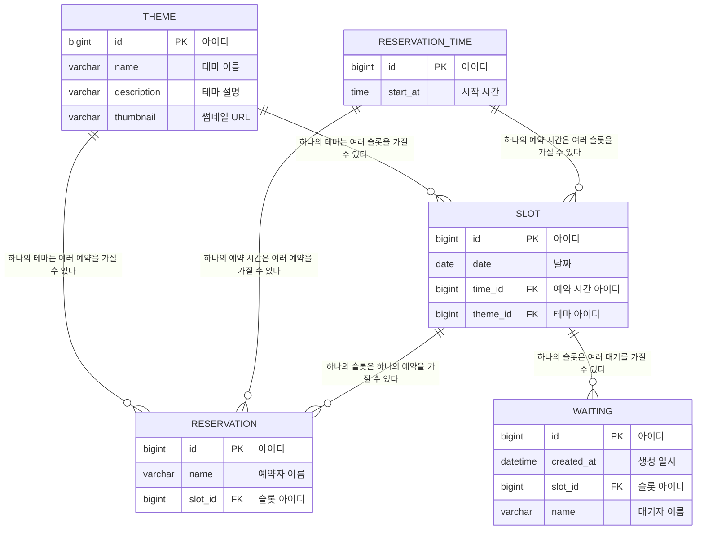

# ERD (Entity Relationship Diagram)

```mermaid
erDiagram
    THEME ||--o{ RESERVATION : "하나의 테마는 여러 예약을 가질 수 있다"
    RESERVATION_TIME ||--o{ RESERVATION : "하나의 예약 시간은 여러 예약을 가질 수 있다"
    SLOT ||--o{ RESERVATION : "하나의 슬롯은 하나의 예약을 가질 수 있다"
    SLOT ||--o{ WAITING : "하나의 슬롯은 여러 대기를 가질 수 있다"
    THEME ||--o{ SLOT : "하나의 테마는 여러 슬롯을 가질 수 있다"
    RESERVATION_TIME ||--o{ SLOT : "하나의 예약 시간은 여러 슬롯을 가질 수 있다"
    
    THEME {
        bigint id PK "아이디"
        varchar name "테마 이름"
        varchar description "테마 설명"
        varchar thumbnail "썸네일 URL"
    }
    
    RESERVATION_TIME {
        bigint id PK "아이디"
        time start_at "시작 시간"
    }
    
    SLOT {
        bigint id PK "아이디"
        date date "날짜"
        bigint time_id FK "예약 시간 아이디"
        bigint theme_id FK "테마 아이디"
    }
    
    RESERVATION {
        bigint id PK "아이디"
        varchar name "예약자 이름"
        bigint slot_id FK "슬롯 아이디"
    }

    WAITING {
        bigint id PK "아이디"
        datetime created_at "생성 일시"
        bigint slot_id FK "슬롯 아이디"
        varchar name "대기자 이름"
    }
```
