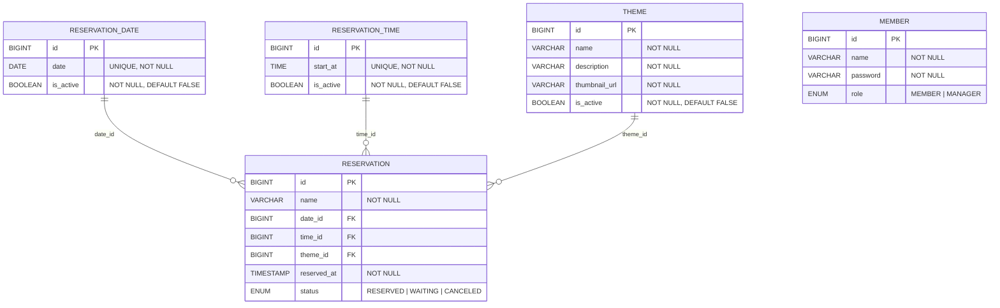

# 요구사항

> 사이클1 - 관리자 여부(인가)는 판단하지 않는다. 인가는 구현하지 않는다.

---

## 1. Reservation

`status` : `RESERVED` | `CANCELED`

### 관리자

**예약을 한다.**
- 날짜와 테마를 선택하고 예약 가능한 시간을 선택하면 예약할 수 있다.
- `dateId`, `timeId`, `themeId`, `status`를 검증한다. (이때, status가 `RESERVED`인지 검증)
- 예약의 기본 상태는 `RESERVED`이다.

**예약을 취소한다.**
- 해당 API를 사용한다는 게, 관리자임을 보장한다고 가정한다. 즉, 관리자인지 별도로 검증하지 않는다.
- 예약 상태를 `CANCELED`로 변경한다.

**예약을 조회한다.**
- 모든 예약을 조회한다.
- 예약 날짜와 예약 시간을 기준으로 내림차순 정렬한다.

**예약을 변경한다.**
- 예약자의 성함 비교를 하지 않는다.
- 이미 취소된 예약은 변경할 수 없다.
- 이미 지난 예약은 변경할 수 없다.
- 변경하려는 날짜/시간이 과거라면 예외가 발생한다.
- 예약 가능한 날짜와 예약 가능한 시간으로 변경할 수 있다.

### 사용자

**예약을 한다.**
- 날짜와 테마를 선택하고 예약 가능한 시간을 선택하면 예약할 수 있다.
- `dateId`, `timeId`, `themeId`, `status`를 검증한다. (이때, status가 `RESERVED`인지 검증)
- 예약의 기본 상태는 `RESERVED`이다.

**예약을 취소한다.**
- 예약자의 성함과 일치하는지 확인한다.
- 예약 상태를 `CANCELED`로 변경한다.

**예약을 조회한다.**
- `username`로 예약을 조회한다.
- 예약 날짜와 예약 시간을 기준으로 내림차순 정렬한다.

**예약을 변경한다.**
- 예약자만 취소할 수 있다.
- 이미 취소된 예약은 변경할 수 없다.
- 이미 지난 예약은 변경할 수 없다.
- 변경하려는 날짜/시간이 과거라면 예외가 발생한다.
- 예약 가능한 날짜와 예약 가능한 시간으로 변경할 수 있다.

---

## 2. ReservationDate

### 관리자

**예약 가능한 날짜를 생성한다.**
- `date`를 보내 생성한다.
  - 이미 존재하는 `date`라면 예외가 발생한다.

**예약 가능한 날짜를 조회한다.**
- `id`, `date`, `isActive`를 포함한 `List<ReservationDateDto>`를 반환한다.

**예약 날짜의 상태를 변경한다.**
- 활성화/비활성화를 전환한다.

### 사용자

**예약 가능한 날짜를 조회한다.**
- 활성화 + 오늘 이후 날짜를 조회한다.

---

## 3. ReservationTime

### 관리자

**예약 가능한 시간을 생성한다.**
- 예약 가능 시간은 1시간 단위이다.
- `startAt`을 보내 생성한다.
- 이미 존재하는 `startAt`이라면 예외가 발생한다.

**예약 가능한 시간을 조회한다.**
- `id`, `time`, `isActive`을 포함한 `List<ReservationTimeDto>`를 반환한다.

**예약 시간의 상태를 변경한다.**
- 활성화/비활성화를 전환한다.

### 사용자

**예약 가능한 시간을 조회한다.**
- 활성화 + 오늘 + 지금 시간 이후를 조회한다.

---

## 4. Theme

`isActive` : `true` | `false`

### 관리자

**테마를 생성한다.**
- `name`, `description`, `thumbnailUrl`을 받아 생성한다.
- 기본 상태는 비활성화(`isActive: false`)이다.

**인기 테마 Top10을 조회한다. (수요 파악용)**
- 취소를 포함한(`RESERVED` + `CANCELED`) 예약 수 Top 10 테마를 반환한다.
- 테마당 예약된 수를 함께 반환한다.

**테마의 상태를 변경한다.**
- 활성화/비활성화를 전환한다.

### 사용자

**인기 테마 Top10을 조회한다. (추천용)**
- 취소를 포함하지 않은(`RESERVED`) 예약 수 Top 10 테마를 조회한다.
- 순위만 반환한다. (예약 수 X)

**활성화된 테마 목록을 조회한다.**

---

## ERD

