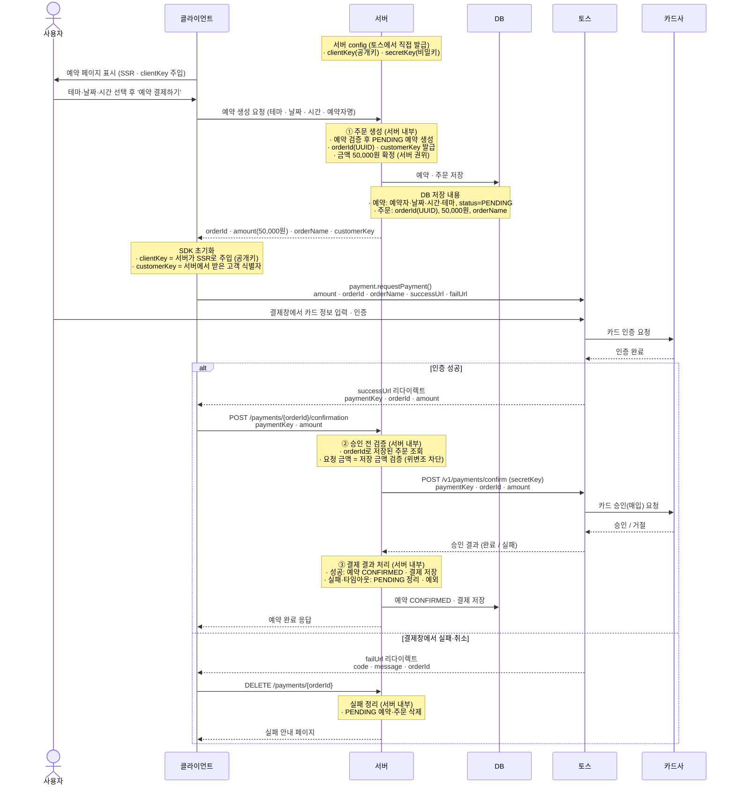

# 토스 결제 연동 시퀀스 흐름도

방탈출 예약 결제(토스페이먼츠 결제창 연동)의 전체 흐름. Stage 0a 산출물.

- 실선 = 요청·호출, 점선 = 응답/리다이렉트
- `clientKey`(공개, 프론트) / `secretKey`(비밀, 서버) 는 둘 다 토스가 발급, 서버 config에 보관
- **인증(결제창) ≠ 승인(서버 confirm)**: 카드사는 두 단계 모두에서 토스 뒤에 있다

