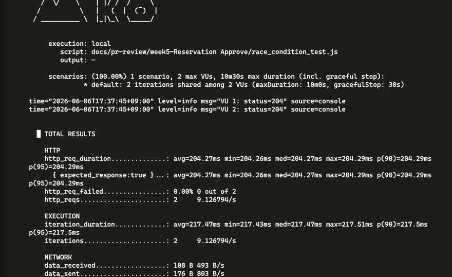
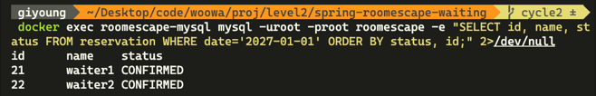
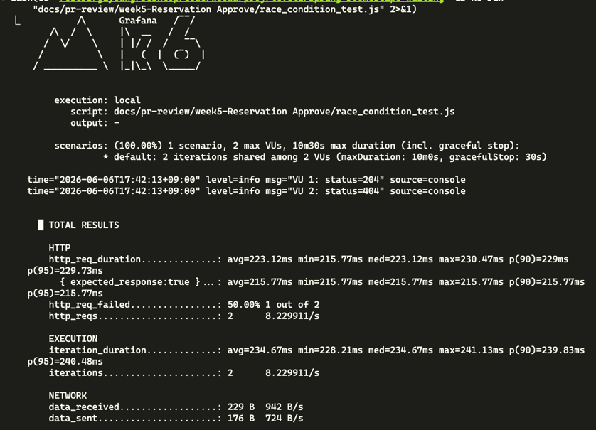
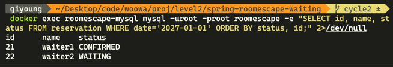

# SELECT FOR UPDATE 동시성 테스트 결과

## 테스트 환경

- DB: MySQL 8 (Docker)
- 부하 도구: k6 (VU 2, iterations 2)
- 대상 API: `DELETE /reservations/{id}`
- Spring Profiles: `mysql`

## 시나리오

같은 예약(id=20, CONFIRMED)을 두 요청이 동시에 취소하면,  
첫 번째 WAITING 예약 하나만 CONFIRMED으로 자동 승인돼야 한다.

### 초기 데이터

| id | name    | status    |
|----|---------|-----------|
| 20 | host    | CONFIRMED |
| 21 | waiter1 | WAITING   |
| 22 | waiter2 | WAITING   |

---

## Case 1 — 락 없음 (`findById`)

`ReservationService.delete`에서 `findByIdForUpdate` 대신 `findById` 사용.

### k6 결과


```
VU 1: status=204
VU 2: status=204
```

두 요청 모두 204 성공 → **레이스 컨디션 발생**

### DB 상태 (테스트 후)


| id | name    | status    |
|----|---------|-----------|
| 21 | waiter1 | CONFIRMED |
| 22 | waiter2 | CONFIRMED |

**waiter1, waiter2 모두 CONFIRMED** — 의도치 않은 이중 승인.

---

## Case 2 — 락 있음 (`findByIdForUpdate`)

`ReservationService.delete`에서 `SELECT ... FOR UPDATE` 사용.

### k6 결과


```
VU 1: status=204
VU 2: status=404
```

첫 번째 요청만 성공, 두 번째는 404(이미 삭제된 예약) → **레이스 컨디션 차단**

### DB 상태 (테스트 후)


| id | name    | status    |
|----|---------|-----------|
| 21 | waiter1 | CONFIRMED |
| 22 | waiter2 | WAITING   |

**waiter1만 CONFIRMED** — 정확히 첫 번째 대기자 한 명만 승인.

---

## 결론

`SELECT ... FOR UPDATE`를 사용하면 동일 예약에 대한 동시 취소 요청에서  
트랜잭션이 직렬화되어 중복 승인을 방지한다.

H2는 트랜잭션을 내부적으로 직렬화하여 레이스 컨디션을 재현할 수 없으므로,  
MySQL 환경에서 k6로 실제 동시 요청을 보내 검증했다.
